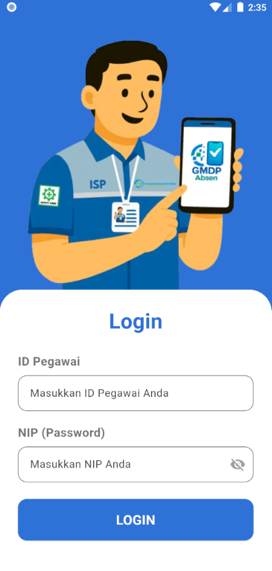
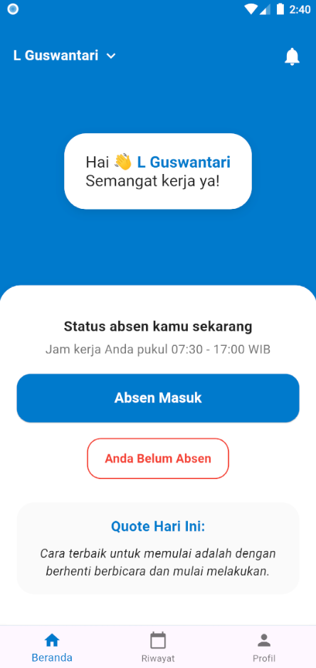
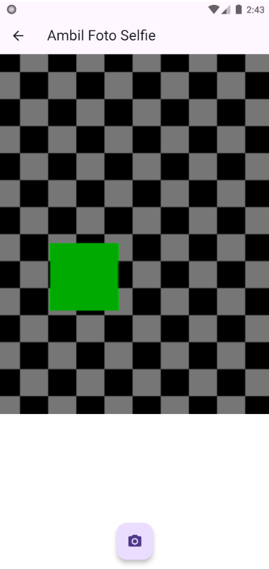
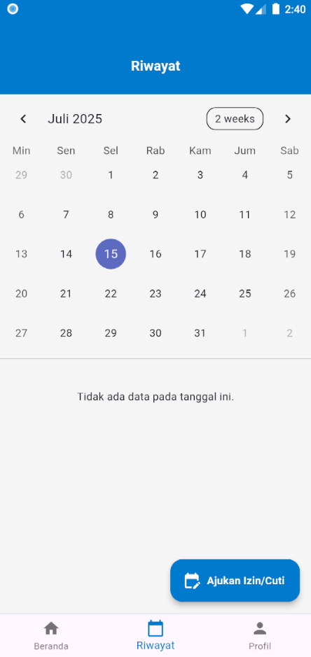
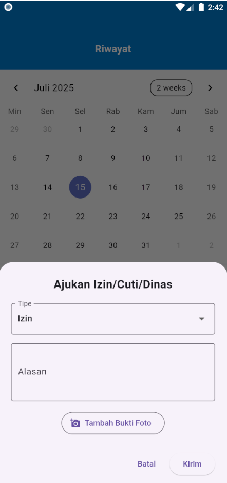
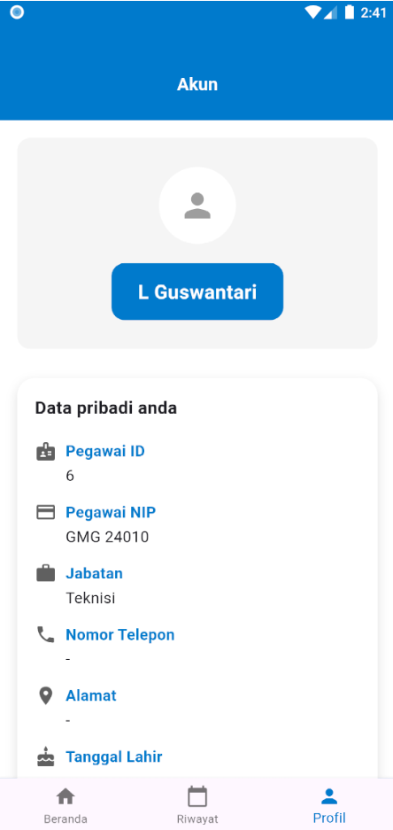
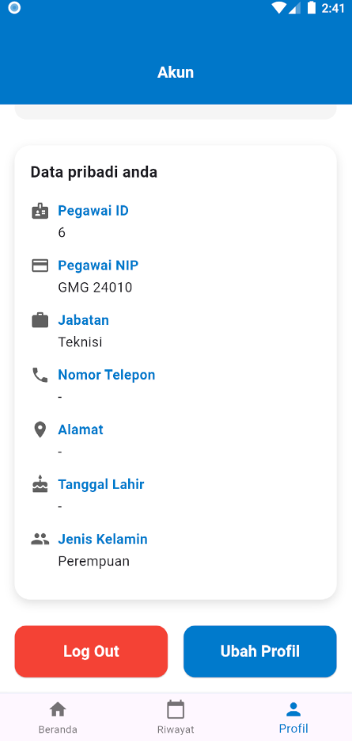
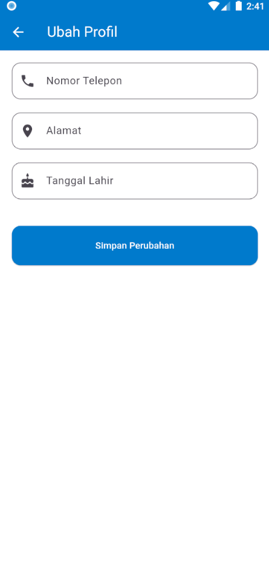
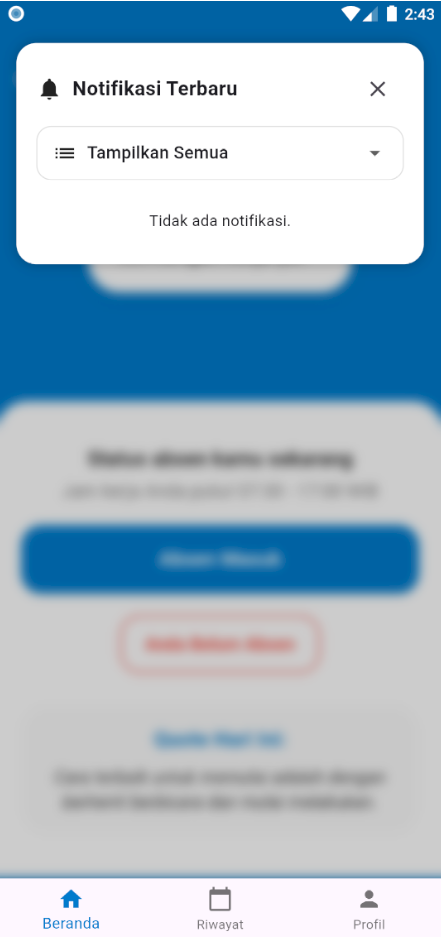

# Aplikasi Absensi Karyawan PT Global Media Data Prima

Aplikasi absensi mobile ini dikembangkan untuk mempermudah proses pencatatan kehadiran karyawan PT Global Media Data Prima (GMDP) dengan fitur-fitur modern dan user-friendly. Dibangun menggunakan Flutter, aplikasi ini menawarkan pengalaman yang mulus di berbagai platform.

## Fitur Utama

- **Login Aman**: Autentikasi karyawan menggunakan ID Pegawai dan NIP.
- **Absen Mandiri**: Karyawan dapat melakukan absen masuk dan keluar dengan mudah.
- **Selfie Wajib**: Mengambil foto selfie saat absen untuk validasi kehadiran.
- **Riwayat Absensi**: Melihat catatan absensi pribadi berdasarkan tanggal.
- **Pengajuan Izin/Cuti/Dinas**: Fitur untuk mengajukan izin, cuti, atau dinas secara digital.
- **Manajemen Profil**: Melihat dan memperbarui data profil pribadi karyawan.
- **Notifikasi**: Menerima pemberitahuan penting terkait absensi atau informasi perusahaan.

## Tampilan Aplikasi (Screenshots)

Berikut adalah beberapa tangkapan layar dari aplikasi absensi ini untuk memberikan gambaran fungsionalitas dan antarmuka pengguna.

### 1. Halaman Login
Halaman awal untuk masuk ke aplikasi, memerlukan ID Pegawai dan NIP. Dilengkapi dengan ilustrasi yang menarik.


### 2. Halaman Beranda (Dashboard)
Setelah login, karyawan akan melihat status absensi terkini, jam kerja, sapaan personal, dan "Quote Hari Ini" untuk motivasi.


### 3. Halaman Absen Selfie
Karyawan mengambil foto selfie untuk memvalidasi kehadiran.


### 4. Halaman Riwayat Absensi
Menampilkan kalender interaktif di mana karyawan dapat melihat riwayat absensi mereka pada tanggal tertentu. Jika tidak ada data, pesan akan ditampilkan.


### 5. Dialog Pengajuan Izin/Cuti/Dinas
Formulir pop-up untuk mengajukan izin, cuti, atau dinas, lengkap dengan opsi untuk menambah bukti foto.


### 6. Halaman Profil (Bagian Atas)
Menampilkan informasi dasar profil karyawan seperti ID, NIP, Jabatan, dan informasi kontak.


### 7. Halaman Profil (Bagian Bawah)
Melanjutkan informasi profil dan menyediakan opsi untuk `Log Out` atau `Ubah Profil`.


### 8. Halaman Ubah Profil
Formulir untuk memperbarui detail pribadi karyawan seperti Nomor Telepon, Alamat, dan Tanggal Lahir.


### 9. Panel Notifikasi
Menampilkan notifikasi terbaru kepada karyawan, dengan opsi untuk melihat semua notifikasi.


## Teknologi yang Digunakan

- **Framework**: Flutter
- **Bahasa Pemrograman**: Dart

## Cara Menggunakan (Untuk Pengembang)

Untuk menjalankan proyek ini secara lokal, ikuti langkah-langkah berikut:

1.  **Clone repository ini:**
    ```bash
    git clone [https://github.com/fadillrr/aplikasi-absensi-gmdp-flutter.git](https://github.com/fadillrr/aplikasi-absensi-gmdp-flutter.git)
    ```
2.  **Masuk ke direktori proyek:**
    ```bash
    cd aplikasi-absensi-gmdp-flutter
    ```
3.  **Dapatkan dependensi:**
    ```bash
    flutter pub get
    ```
4.  **Jalankan aplikasi:**
    ```bash
    flutter run
    ```